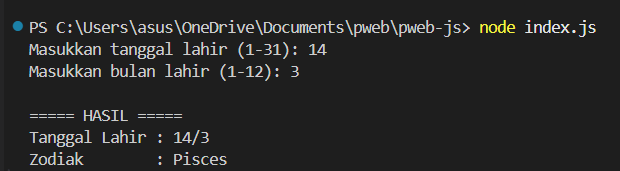
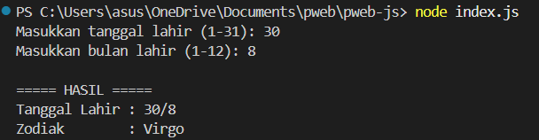
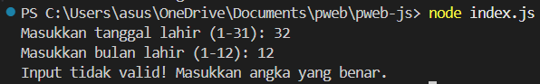

# Program Penentu Zodiak Berbasis Terminal (Node.js)

# Deskripsi Program

Aplikasi ini merupakan program sederhana berbasis terminal yang dikembangkan menggunakan JavaScript dan dijalankan dengan Node.js. Fungsinya adalah untuk menentukan tanda zodiak seseorang berdasarkan tanggal dan bulan kelahiran yang dimasukkan melalui terminal.

Pengguna diminta memasukkan dua data utama, yaitu tanggal (1–31) dan bulan (1–12). Program kemudian memproses data tersebut dengan mencocokkannya pada rentang tanggal astrologi standar untuk menghasilkan nama zodiak yang sesuai.

Seluruh proses berjalan melalui Command Line Interface (CLI) tanpa menggunakan tampilan grafis maupun teknologi web.

# Struktur Folder Proyek

Berikut adalah susunan direktori proyek:

pweb-js/
│
├── index.js
├── README.md
├── output1.png
├── output2.png
├── output3.png
├── output4.png

# Penjelasan Kode

Program diawali dengan mengimpor modul bawaan Node.js, yaitu readline. Modul ini digunakan untuk mengelola proses input dan output pada terminal. Dengan modul ini, program dapat membaca data yang diketik pengguna serta menampilkan hasil ke layar.

Selanjutnya, dibuat sebuah interface menggunakan metode createInterface(). Interface ini menghubungkan process.stdin sebagai sumber input dan process.stdout sebagai media output. Objek tersebut digunakan untuk menjalankan metode question() guna meminta data dari pengguna.

Program kemudian mendefinisikan fungsi bernama getZodiac yang menerima dua parameter: tanggal dan bulan. Fungsi ini berisi serangkaian percabangan menggunakan struktur if dan else if. Setiap kondisi memeriksa apakah kombinasi tanggal dan bulan termasuk dalam rentang tertentu yang mewakili satu zodiak.

Operator logika AND (&&) digunakan untuk memastikan bulan dan tanggal berada dalam satu rentang yang sama. Operator OR (||) digunakan karena satu zodiak biasanya mencakup dua bulan berbeda. Jika suatu kondisi terpenuhi, fungsi akan mengembalikan nama zodiak dalam bentuk string. Jika tidak ada kondisi yang cocok, fungsi mengembalikan null.

Setelah fungsi didefinisikan, program meminta pengguna memasukkan tanggal dan bulan melalui metode question(). Data yang diterima masih berupa string, sehingga perlu dikonversi menjadi tipe numerik menggunakan parseInt() agar dapat dibandingkan secara logika.

Sebelum menentukan hasil, program melakukan validasi untuk memastikan bahwa:

Input merupakan angka

Tanggal berada dalam rentang 1–31

Bulan berada dalam rentang 1–12

Jika data tidak memenuhi kriteria tersebut, program akan menampilkan pesan kesalahan. Jika valid, fungsi penentu zodiak dipanggil dan hasilnya ditampilkan ke terminal.

Sebagai langkah akhir, interface ditutup menggunakan metode close() agar proses eksekusi Node.js selesai dengan benar.

# Kesimpulan

Program ini menunjukkan penerapan dasar JavaScript dalam lingkungan Node.js, termasuk penggunaan modul bawaan, pengolahan input/output terminal, struktur percabangan, validasi data, serta pemanggilan fungsi. Alur kerja dirancang secara sistematis agar mampu menerima data pengguna, memprosesnya sesuai aturan astrologi, dan menghasilkan output yang tepat.

# Output Program

